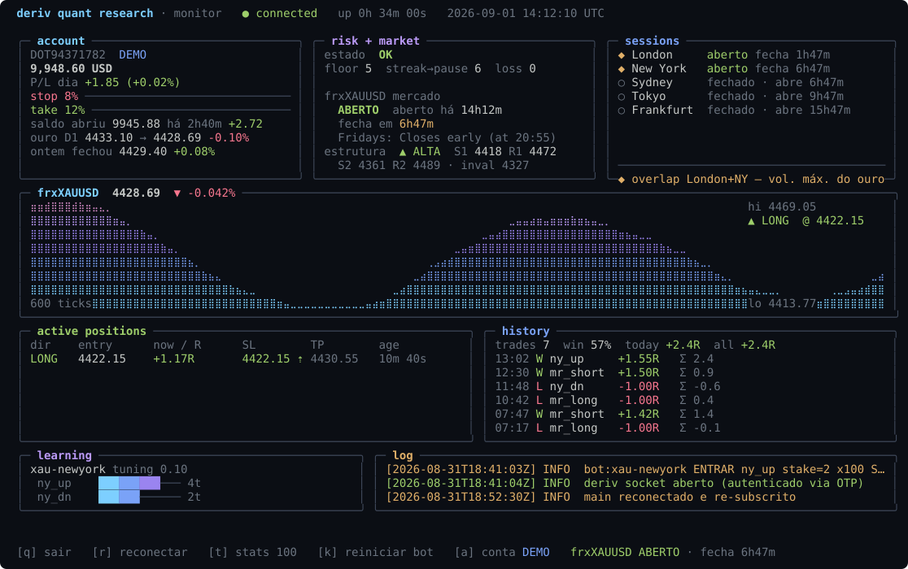

# Deriv Quant Research Framework

A headless, production-shaped framework for **building, backtesting and running
algorithmic trading strategies on [Deriv](https://deriv.com)** — plus a disciplined
research loop for deciding whether a strategy is worth real money.

Node.js · TypeScript · zero runtime dependencies (`ws` only) · Python 3 sidecar (stdlib
only). Connects to Deriv's current **Options API** over WebSocket, with auto-reconnect,
global risk management, an online-learning layer, an offline backtester, a btop-style
terminal monitor, and Telegram alerts.



> **Honest disclaimer.** This was built to find a profitable edge on Deriv's markets.
> After six rigorous investigations (synthetic Volatility / Jump / Boom-Crash / Step
> indices, last-digit contracts, and real spot Gold) **no strategy showed positive
> expectancy net of cost.** See [`FINDINGS.md`](FINDINGS.md). It is kept as a reference
> implementation and a demonstration of method — not as a money-making bot. The two
> Gold strategies currently enabled run on a **demo account** for forward-testing.

**Contents** ·
[Why](#why-this-repo-is-interesting) ·
[Architecture](#architecture) ·
[Quick start](#quick-start) ·
[Monitor](#monitor-toolsdashboardts) ·
[Telegram](#telegram-alerts) ·
[Findings](#what-was-tested--see-findingsmd)

---

## Why this repo is interesting

Most public trading-bot repos advertise win rates and hide the math. This one does the
opposite: it ships the tooling to **measure expectancy honestly** and a written record
of every idea that was tested and rejected, with the numbers ([`FINDINGS.md`](FINDINGS.md)).

If you're evaluating the engineering: the substance is in `src/` (a clean event-driven
trading engine), `tools/` (a cost-aware backtester + statistical analysis scripts + the
monitor), and `ml/` (a dependency-free online-learning sidecar in Python talking to Node
over a line-delimited JSON stdio protocol).

---

## Architecture

```
src/
  index.ts            orchestrator: config → connection → routes ticks/contracts to bots
  deriv/client.ts     Options API client: REST OTP handshake, WebSocket, req_id
                      correlation, exponential-backoff reconnect, re-subscription,
                      getProposal / buyProposal / sellContract
  risk/manager.ts     account guardrails: daily stop-loss / take-profit, hard floor,
                      loss-streak cooldown, concurrency caps — every order passes through
  learn/learner.ts    adaptive layer (TS): Thompson-sampling bandit per bot × bet type,
                      EV gate, kill-switch + probation, parameter hill-climb, persisted
  ml/bridge.ts        spawns the Python sidecar, line-delimited JSON protocol, graceful
                      fallback if Python is absent
  bot.ts              one bot = one strategy + one symbol; 3 gates before an order
                      (bandit → ML → risk); martingale, per-bot SL/TP, daily caps
  strategies/index.ts the Strategy interface + registry (currently: Gold research
                      strategies; synthetic-index strategies archived)
  util/               indicators (SMA/EMA/RSI/Stochastic/fractal swings), candle
                      aggregation + resampling, feature vector, logger
ml/
  predictor.py        online logistic regression (SGD), stdlib only, weights persisted
  util/telegram.ts    dependency-free Telegram Bot API notifier (fetch + 1/s queue)
  util/session.ts     data/session.json — session open balance / previous close
  util/journal.ts     data/trades.jsonl — per-trade open/close events
tools/
  dashboard.ts        btop-style monitor TUI (read-only; never trades)
  backtest.ts         offline backtester for candle strategies (real Deriv cost model)
  scan-symbols.ts     rank symbols by backtested expectancy
  render-svg.ts       renders one dashboard frame to an SVG (docs/dashboard.svg)
  gold-*.ts           the Gold/USD investigation (download, characterize, 23-run suite)
  jump-analyze.ts     Jump Index jump-detection & post-jump behaviour analysis
  digit-analyze.ts    chi-square / autocorrelation / transition-matrix / EV table
                      for last-digit contracts
```

### The research loop

1. **Hypothesis** — what structural feature would give an edge?
2. **Sanity check** — does it survive the fact that the price generator is (for
   synthetics) a CSPRNG, or (for Gold) near-random-walk intraday?
3. **Implement** as a `Strategy` (`kind: "candle" | "riseFall" | "digits"`).
4. **Backtest** on 15k+ candles, **net of the real contract cost**, across parameter
   variations and symbols. Sample < ~150 trades → inconclusive.
5. **Verdict** by **expectancy in R**, never win rate. A 40 %-win 1:2 strategy makes
   money; a 90 %-win +11 %-payout strategy loses.

`.claude/skills/` and `.claude/agents/` package this loop for [Claude
Code](https://claude.com/claude-code).

---

## Quick start

Requires **Node ≥ 22.18** (runs `.ts` natively) and, optionally, **Python 3.8+** for
the ML sidecar.

```bash
npm install
cp .env.example .env      # then fill in DERIV_TOKEN + DERIV_APP_ID
```

**Credentials** — at [developers.deriv.com/dashboard](https://developers.deriv.com/dashboard):
register a Native application (scopes Read + Trade) for the **App ID**, and generate a
**Personal Access Token** (`pat_…`) for `DERIV_TOKEN`. Both must come from the same
dashboard. The client resolves your account, does the REST OTP handshake, and connects.

```bash
npm run typecheck                                   # tsc --noEmit
node --env-file=.env tools/backtest.ts <strategy> <symbol> --candles 15000
node --env-file=.env src/index.ts                   # live (demo account by default)
node --env-file=.env tools/dashboard.ts             # btop-style monitor TUI
```

### Monitor (`tools/dashboard.ts`)


A full-screen terminal dashboard in the spirit of [btop](https://github.com/aristocratos/btop):
rounded panels, gradient meters, braille price graphs. It **only observes** — never
trades. Panels:

- **account** — balance, the day's P/L *from the bots* against the daily stop/take
  meters, this session's opening balance, the previous session's close
- **risk + market** — risk state, and the instrument's market hours: open/closed,
  how long it's been open, how long until it closes (from `trading_times`)
- **bots** — per bot: its UTC window, live state (`ANALISANDO` / `EM POSIÇÃO` /
  `FORA DA JANELA` / `PARADO` / market closed), how long it's been analyzing for the
  next entry, and its W/L + cumulative R
- **price · active positions · history · learning · log** — live braille chart with
  position markers, open positions with unrealized R and SL/TP, closed-trade history
  with cumulative R, the bandit/ML state, and a tail of `data/bot.log`

Shortcuts: `q` quit · `r` refresh · `a` switch the monitor between demo/real (real
asks to confirm). `--once` to print one frame. Truecolor terminal recommended
(Windows Terminal works).

Open positions and history come from `data/trades.jsonl` (written by the bot);
session balances from `data/session.json`. Regenerate the image with
`node tools/render-svg.ts docs/dashboard.svg` (uses synthetic `--demo` data).

`config.json` trades **only Gold / USD** (`frxXAUUSD`, Multipliers) — three setups on
the one pair to study it in depth: `xau-meanrev-london` (Bollinger + RSI in the London
window), `xau-ny-momo` (NY-session momentum), and `xau-meanrev-24h` (the mean-reversion
logic with no session filter, for more samples). The monitor's **sessions** panel shows
the five major FX trading centres (Sydney → Tokyo → Frankfurt → London → New York) as a
pure time-window clock — open / closed / opens-in, with the London+NY overlap flagged
as the peak-volatility window for Gold. Nothing but XAUUSD is ever traded; the sessions
are context only, since Gold's intraday behaviour tracks that Asian → London → NY
handover.

24/7 process supervision via PM2: `pm2 start ecosystem.config.cjs`.

### Telegram alerts

Optional push alerts for **trade open / trade close / bot start-stop / risk HALT**,
plus a periodic status digest. In `.env`:

```
TELEGRAM_BOT_TOKEN=...    # from @BotFather
TELEGRAM_CHAT_ID=...      # your chat id (@userinfobot, or /getUpdates)
```

Toggle each event and the digest interval in `config.json → alerts.telegram`. Test
with `node --env-file=.env tools/telegram-test.ts`. No credentials → silent no-op.

---

## What was tested — see [`FINDINGS.md`](FINDINGS.md)

| Market | Contract types | Verdict |
|---|---|---|
| Volatility indices (V10–V100, 1s & 2s) | Rise/Fall, Digits, Multipliers | no edge — CSPRNG |
| Jump indices (JD10–JD100) | Multipliers | no edge — Poisson jumps, 50/50 direction |
| Boom / Crash / Step | Multipliers | no edge — asymmetric / no trend |
| Last-digit contracts (13 symbols) | Match/Diff/Over/Under/Even/Odd | no edge — χ² confirms uniform; all 40 EV combos negative |
| **Gold / USD (`frxXAUUSD`)** | Multipliers | tiny gross edge (mean-reversion in London, +0.043 R), smaller than the multiplier commission → net negative |

The consistent finding: the limitation is the **product**, not the strategy. Deriv's
synthetics are provably random; Deriv's real-asset intraday feed is near-random-walk
and the right contract's commission eats sub-0.1 R edges.

---

## License

MIT — see [`LICENSE`](LICENSE). Provided as-is, for education. Not financial advice.
